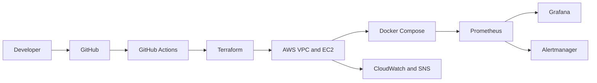
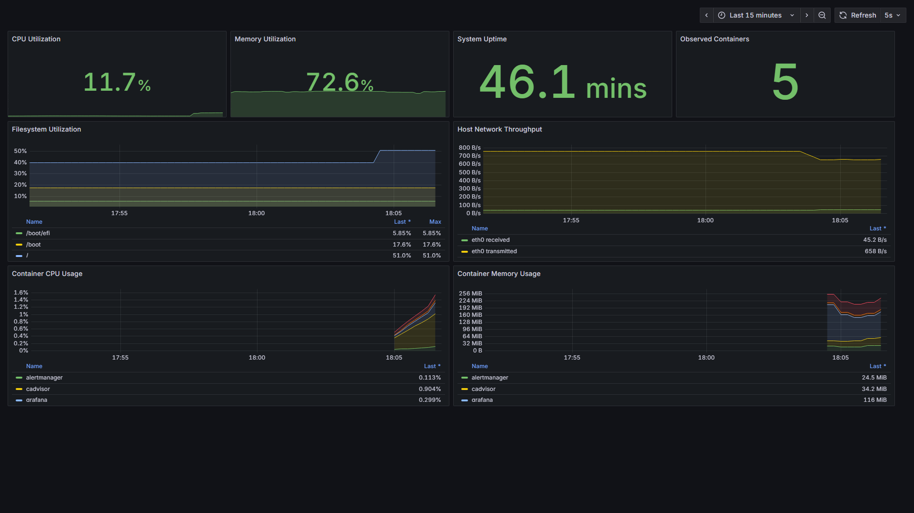
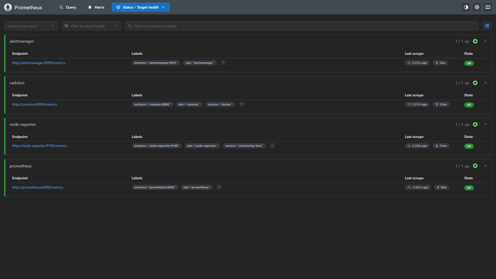
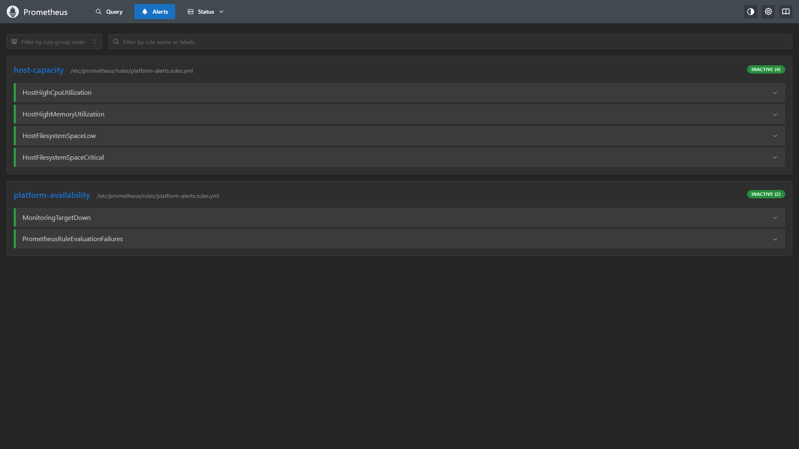
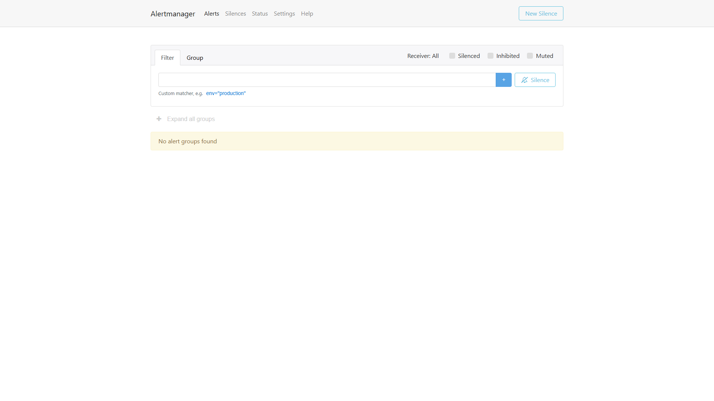
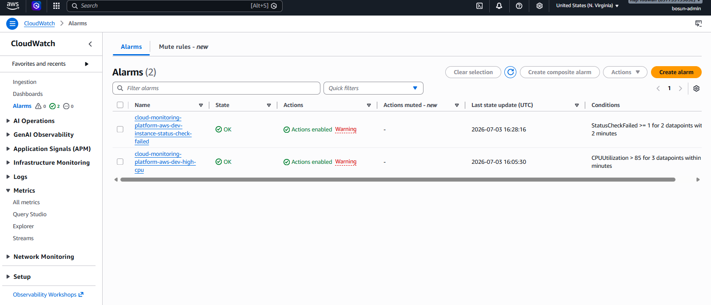
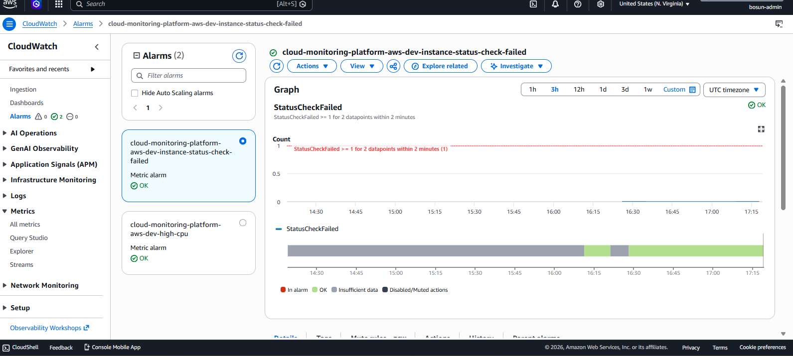

# Cloud Monitoring Platform on AWS

A production-inspired observability platform built with AWS, Terraform, Docker,
Prometheus, Grafana, Alertmanager, CloudWatch, and GitHub Actions.

The project demonstrates infrastructure as code, Linux automation, metrics and
log collection, dashboards as code, alert routing, least-privilege IAM,
security-first administration, CI validation, and operational documentation.

> Status: implementation, AWS deployment validation, and portfolio evidence
> capture complete. The environment is intentionally short-lived to control
> cost.

## Architecture



See [the detailed architecture](docs/architecture.md) for component boundaries,
data flows, decisions, and production tradeoffs.

## What It Demonstrates

| Area | Implementation |
| --- | --- |
| Infrastructure | Modular Terraform for VPC, EC2, IAM, CloudWatch, and SNS |
| Host automation | Ubuntu bootstrap with Docker and CloudWatch Agent |
| Metrics | Prometheus, Node Exporter, and cAdvisor |
| Visualization | Provisioned Grafana datasource and eight-panel dashboard |
| Alerting | Prometheus rules, Alertmanager routing, Slack, and SNS |
| Logging | System, bootstrap, and Docker logs in CloudWatch |
| Security | No default ingress, SSM access, IMDSv2, encrypted storage |
| CI | Terraform, monitoring, dashboard, and Trivy validation |
| Operations | Deployment, teardown, troubleshooting, and cost runbooks |

## Key Design Choices

- Services bind to localhost and are accessed through encrypted SSM tunnels.
- Terraform modules follow infrastructure ownership boundaries.
- Monitoring configuration and Grafana dashboards are version-controlled.
- Container images and Terraform providers are version-pinned.
- Metrics, log, and Docker retention are bounded for a small development host.
- CI has read-only repository permissions and no AWS credentials.
- CloudWatch Logs access is restricted to project-specific log groups.

## Repository Structure

```text
.
|-- .github/             # CI workflow and dependency updates
|-- alertmanager/        # Routing, inhibition, and receiver configuration
|-- architecture/        # Editable Mermaid architecture source
|-- docker/              # Docker Compose and environment example
|-- docs/                # Architecture and operational documentation
|-- grafana/             # Provisioning and dashboard JSON
|-- prometheus/          # Scrape configuration, recording rules, alerts
|-- screenshots/         # Sanitized portfolio evidence checklist
|-- scripts/             # Validation and deployment automation
`-- terraform/
    |-- environments/dev/
    `-- modules/
        |-- cloudwatch/
        |-- compute/
        |-- iam/
        `-- network/
```

## Validate Locally

Terraform:

```bash
terraform fmt -check -recursive
terraform -chdir=terraform/environments/dev init -backend=false
terraform -chdir=terraform/environments/dev validate
```

Monitoring configuration requires a running Docker daemon:

```bash
bash scripts/validate-monitoring.sh
```

These commands validate configuration only and do not create AWS resources.

## Deployment

Read the [cost controls](docs/cost-control.md), then follow the
[deployment guide](docs/deployment-guide.md). The guide covers Terraform review,
SSM access, runtime secrets, stack startup, smoke tests, and teardown.

AWS services are not guaranteed to be free. EC2, public IPv4, EBS, CloudWatch,
and SNS can incur charges.

## Deployment Evidence

### Grafana Platform Overview



### Prometheus Targets



### Prometheus Alert Rules



### Alertmanager



### CloudWatch Alarms



### CloudWatch Alarm Detail



## Documentation

- [Architecture](docs/architecture.md)
- [Deployment and teardown](docs/deployment-guide.md)
- [CI/CD](docs/ci-cd.md)
- [Security considerations](docs/security-considerations.md)
- [Cost control](docs/cost-control.md)
- [Troubleshooting runbook](docs/troubleshooting.md)
- [Lessons learned](docs/lessons-learned.md)
- [Interview guide](docs/interview-guide.md)
- [Screenshot checklist](screenshots/README.md)

## Production Evolution

The next production steps are encrypted remote Terraform state, GitHub OIDC
deployment, private subnets with VPC endpoints, HTTPS ingress, centralized
secrets, immutable image digests, highly available metrics storage, and tested
backup and recovery.
