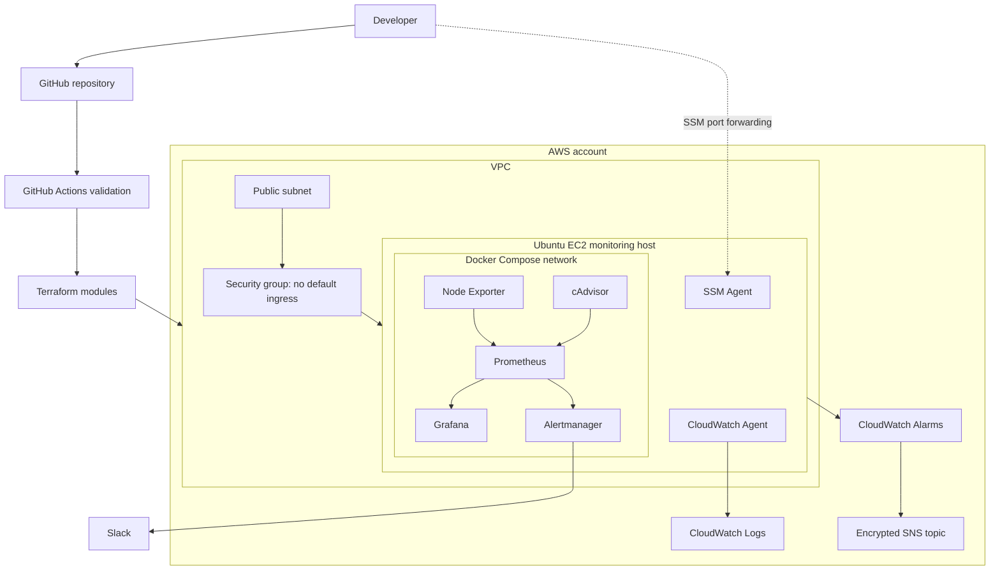

# Architecture

## System View

The editable Mermaid source is in `architecture/platform.mmd`.

## Data Flows

1. Node Exporter exposes Ubuntu host metrics to Prometheus.
2. cAdvisor exposes Docker container metrics to Prometheus.
3. Grafana queries Prometheus over the private Compose network.
4. Prometheus sends firing and resolved alerts to Alertmanager.
5. Alertmanager groups, inhibits, and sends notifications to Slack.
6. CloudWatch Agent forwards system, bootstrap, and Docker logs.
7. Native EC2 alarms notify an encrypted SNS topic.

## Module Boundaries

| Module | Ownership |
| --- | --- |
| `network` | VPC, subnet, internet gateway, route table |
| `compute` | Security group, Ubuntu EC2, encrypted EBS, bootstrap |
| `iam` | EC2 role, SSM access, scoped CloudWatch Logs access |
| `cloudwatch` | Log groups, retention, alarms, SNS |

## Design Decisions

- One EC2 host keeps the portfolio environment inexpensive and understandable.
- Terraform modules separate ownership without hiding a small design behind too
  many abstractions.
- SSM replaces default inbound administration and provides encrypted tunnels.
- Prometheus and CloudWatch overlap intentionally: Prometheus handles detailed
  workload telemetry; CloudWatch provides AWS-native logs and instance alarms.
- Configurations and dashboards are provisioned from Git rather than edited
  manually in web interfaces.

## Production Tradeoffs

This is production-inspired, not a highly available production platform. A
larger deployment would use private subnets, multiple instances or a managed
container platform, remote Terraform state, durable external metrics storage,
HTTPS ingress, centralized secrets, and tested backup/restore procedures.
